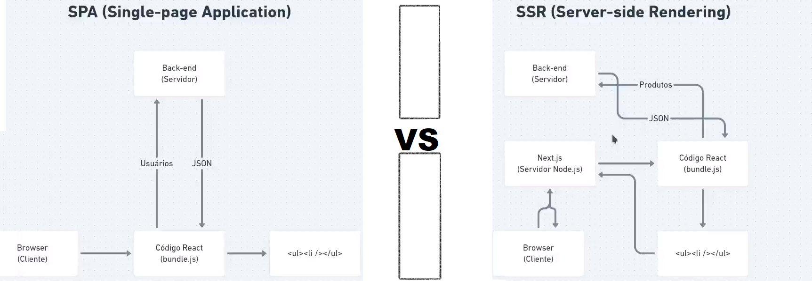
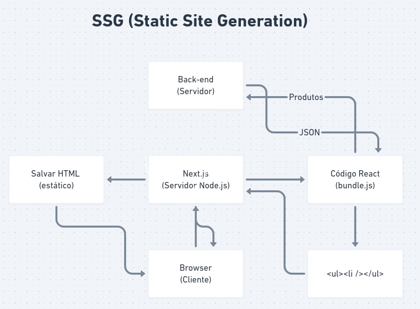

# 💻 Sobre o Coin Bot (Frontend)

Frontend para visualização e interação com a API.

### APP model SPA (Single Page Application) vs SSR (Server Side Rendering)

<h1 align="center">
    
</h1>

### SSG (Static Site Generation)

<h1 align="center">
    
</h1>

### When use SPA, SSR and SSG

- SPA (client-side) dynamic information not recomended for informatin indexation on searchs
  * by useEfect
- SSR (server-side) dynamic information, especific information for a especific user
  * by GetServerSideProps
- SSG (static) static information, generic information for all users.
  * by GetStaticProps

### Execute

```bash
git clone
cd coin-bot
cd frontend
yarn
yarn dev
```
